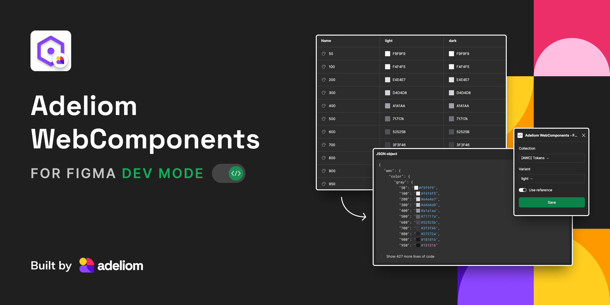

# Adeliom WebComponents - For Figma Dev Mode



**Adeliom WebComponents - For Figma Dev Mode** is a dedicated plugin designed for enhancing the workflow of Figma users, especially in development mode. This tool is engineered to streamline the design-to-code transition, crucial for modern web development.

**Key Features**

-   Variable Extraction: Extracts design variables directly from Figma files.
-   Format Conversion: Transforms these variables into CSS and JSON formats, ensuring seamless integration.
-   Compatibility with AWC: Specifically tailored to be fully compatible with Adeliom WebComponents (AWC) design systems.

**Benefits**

-   Efficiency in Design Workflow: Significantly reduces the time and effort needed to convert design elements into usable code.
-   Seamless Integration: Facilitates an effortless transition of design elements into the AWC ecosystem, maintaining design integrity and consistency.
-   Bridging Design and Development: Ideal for teams seeking a cohesive workflow between designers and developers.

**Use Cases**

-   Web Development: Perfect for developers working with complex web components.
-   UI/UX Design: Assists designers in visualizing how their designs will translate into actual web components.

**Learn More**

For a deeper understanding of how `Adeliom WebComponents - For Figma Dev Mode` integrates with the AWC design systems, visit [AWC Design Systems](https://webcomponents.adeliom.io/).

## Development guide

*This plugin is built with [Create Figma Plugin](https://yuanqing.github.io/create-figma-plugin/).*

### Pre-requisites

- [Node.js](https://nodejs.org) – v18
- [Figma desktop app](https://figma.com/downloads/)

### Build the plugin

To build the plugin:

```
$ npm run build
```

This will generate a [`manifest.json`](https://figma.com/plugin-docs/manifest/) file and a `build/` directory containing the JavaScript bundle(s) for the plugin.

To watch for code changes and rebuild the plugin automatically:

```
$ npm run watch
```

### Install the plugin

1. In the Figma desktop app, open a Figma document.
2. Search for and run `Import plugin from manifest…` via the Quick Actions search bar.
3. Select the `manifest.json` file that was generated by the `build` script.

### Debugging

Use `console.log` statements to inspect values in your code.

To open the developer console, search for and run `Open Console` via the Quick Actions search bar.

## See also

- [Create Figma Plugin docs](https://yuanqing.github.io/create-figma-plugin/)
- [`yuanqing/figma-plugins`](https://github.com/yuanqing/figma-plugins#readme)

Official docs and code samples from Figma:

- [Plugin API docs](https://figma.com/plugin-docs/)
- [`figma/plugin-samples`](https://github.com/figma/plugin-samples#readme)
